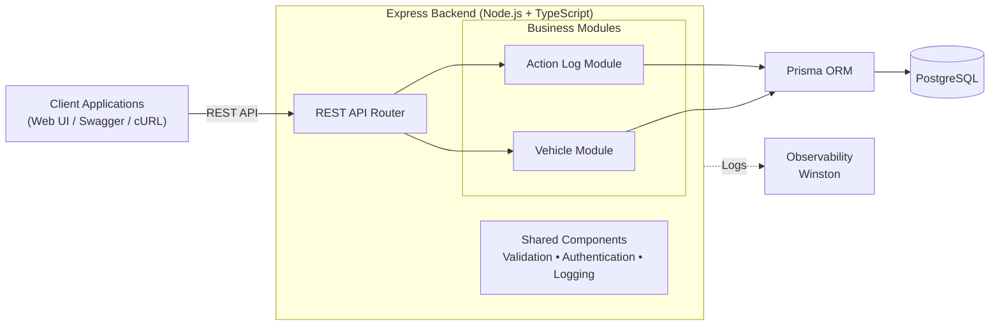
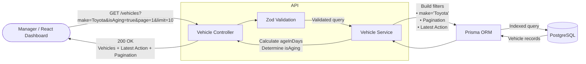
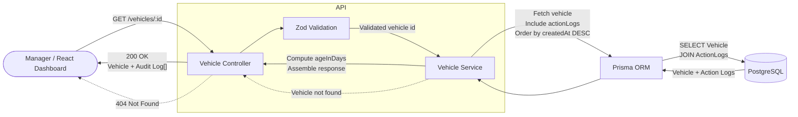
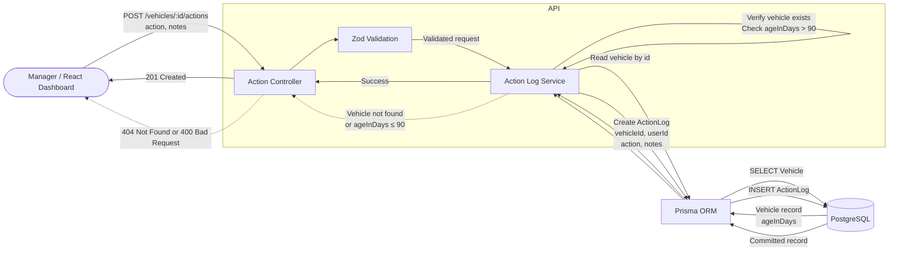
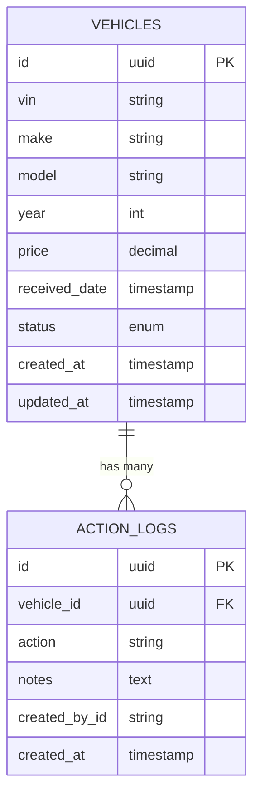

# Intelligent Inventory Dashboard — System Design Document

**Scenario:** B — Intelligent Inventory Dashboard (Supply domain)

**Implementation choice:** Backend service (REST API + persistent database), frontend mocked via OpenAPI spec / CURL harness.

---

# 1. Introduction

## Purpose

The Intelligent Inventory Dashboard provides dealership managers with a real-time overview of vehicle inventory, helping them quickly identify aging stock and track actions taken to improve inventory turnover.

The proposed solution focuses on simplicity, maintainability, and scalability while satisfying the functional requirements of this assessment.

---

# 2. Requirements Summary

The system must support the following capabilities:

1. Display dealership inventory with filtering by attributes such as make, model, and inventory age.
2. Automatically identify vehicles that have remained in inventory for more than 90 days.
3. Allow managers to record and persist an action or status for each aging vehicle.

---

# 3. Assumptions

The assessment intentionally contains ambiguous requirements. The following assumptions were made during the design process.

| #   | Ambiguity                                                          | Assumption Made                                                                                                                                        |
| --- | ------------------------------------------------------------------ | ------------------------------------------------------------------------------------------------------------------------------------------------------ |
| 1   | How do I count "age"?                                              | Calendar days since the vehicle arrived. Simple and matches what the task says.                                                                        |
| 2   | Can an action be free text, or does it need a fixed list?          | I chose free text. The task only gave examples, not a strict list. This keeps it flexible for managers.                                                |
| 3   | Can you log an action on a vehicle that is not aging yet?          | I said no. The task says "log actions for aging vehicles," not all vehicles. So I enforce that rule in the code, not just in the docs.                 |
| 4   | Should a new action overwrite the old status, or build up history? | I made it append-only, so every action gets logged. Keeps a full trail for accountability, barely costs anything extra.                                |
| 5   | Does "real-time" mean live push updates?                           | I used normal request/response instead of WebSockets. Nothing calls for a live feed, and a refresh-based dashboard is simpler.                         |
| 6   | Does a sold or reserved vehicle need special handling?             | I added a status field, and only counted "in stock" vehicles as aging. Keeps sold cars from showing up forever without building a full sales workflow. |
| 7   | Does this need full login/auth built in?                           | No. I assumed the platform handles login and just passes in the manager's identity. Keeps the app focused on its own job.                              |

---

# 4. High-Level Architecture



---

# 5. Component Responsibilities

| Component          | Role                                                                                                                                                                                                                      |
| ------------------ | ------------------------------------------------------------------------------------------------------------------------------------------------------------------------------------------------------------------------- |
| Client Application | Responsible for: <br> - Displaying inventory <br> - Filtering and highlighting aging stock <br> - Recording manager actions                                                                                               |
| Express Backend    | Provides REST APIs and coordinates business logic. <br> Responsibilities include: <br> - Request validation <br> - Business rule execution <br> - Aging stock calculation <br> - Action persistence <br> - Error handling |
| Vehicle Module     | Responsible for: <br> - Inventory retrieval <br> - Filtering <br> - Pagination <br> - Aging stock identification                                                                                                          |
| Action Log Module  | Responsible for: <br> - Recording manager actions <br> - Maintaining action history <br> - Returning the latest action for each vehicle                                                                                   |
| Prisma ORM         | Provides type-safe database access and migration management while abstracting SQL queries                                                                                                                                 |
| PostgreSQL         | Stores: <br> - Vehicle inventory <br> - Manager actions                                                                                                                                                                   |
| Observability      | Responsible for application logging, error tracking, and audit trails (Winston)                                                                                                                                           |

# 6. Data Flow

## Flow 1: Filtering Inventory & Identifying Aging Vehicles



## Flow 2: Get Vehicle



## Flow 3: Logging an Action on Aging Stock



# 7. Technology Choices

| Layer      | Technology         | Justification                                                 |
| ---------- | ------------------ | ------------------------------------------------------------- |
| Frontend   | React + TypeScript | Strong typing, reusable components, excellent ecosystem       |
| Backend    | Node.js + Express  | Lightweight framework suitable for REST APIs                  |
| Language   | TypeScript         | Improves maintainability and reduces runtime errors           |
| ORM        | Prisma             | Type-safe queries, migrations, excellent developer experience |
| Database   | PostgreSQL         | Reliable relational database with strong indexing support     |
| Validation | Zod                | Runtime validation with inferred TypeScript types             |
| Logging    | Winston            | Structured JSON logging                                       |

---

# 8. Data Model Overview

# Entity Relationship Diagram



Relationship:

- One Vehicle can have many Action Logs.
- Every Action Log belongs to exactly one Vehicle.
- Deleting a Vehicle automatically removes its Action Logs using **ON DELETE CASCADE**.

---

# Database Tables

## vehicles

Stores every vehicle currently tracked by the dealership.

| Column        | Type          | Constraints       | Description                    |
| ------------- | ------------- | ----------------- | ------------------------------ |
| id            | UUID          | Primary Key       | Internal identifier            |
| vin           | VARCHAR(17)   | Unique, Not Null  | Vehicle Identification Number  |
| make          | VARCHAR(50)   | Not Null          | Manufacturer                   |
| model         | VARCHAR(50)   | Not Null          | Vehicle model                  |
| year          | INTEGER       | Not Null          | Manufacturing year             |
| price         | DECIMAL(10,2) | Not Null          | Vehicle selling price          |
| received_date | TIMESTAMP     | Not Null          | Date vehicle entered inventory |
| status        | ENUM          | Default: IN_STOCK | Current inventory status       |
| created_at    | TIMESTAMP     | Default NOW()     | Record creation timestamp      |
| updated_at    | TIMESTAMP     | Auto Updated      | Last modification timestamp    |

### Vehicle Status Enum

| Value    | Description                   |
| -------- | ----------------------------- |
| IN_STOCK | Vehicle is available for sale |
| RESERVED | Reserved by a customer        |
| SOLD     | Vehicle has been sold         |

> **Assumption:** Although only `IN_STOCK` is required by the scenario, additional statuses (`RESERVED`, `SOLD`) are included to support realistic dealership inventory management.

---

## action_logs

Stores immutable audit records whenever a manager performs an action on a vehicle.

| Column        | Type         | Constraints   | Description            |
| ------------- | ------------ | ------------- | ---------------------- |
| id            | UUID         | Primary Key   | Action identifier      |
| vehicle_id    | UUID         | Foreign Key   | Related vehicle        |
| action        | VARCHAR(255) | Not Null      | Action performed       |
| notes         | TEXT         | Nullable      | Optional manager notes |
| created_by_id | VARCHAR(50)  | Nullable      | Manager identifier     |
| created_at    | TIMESTAMP    | Default NOW() | Action timestamp       |

### Foreign Key

| Column     | References  | On Delete |
| ---------- | ----------- | --------- |
| vehicle_id | vehicles.id | CASCADE   |

---

# 9. API Overview

| Method | Endpoint                 | Purpose                                          |
| ------ | ------------------------ | ------------------------------------------------ |
| GET    | `/vehicles`              | Retrieve inventory with filtering and pagination |
| GET    | `/vehicles/{id}`         | Retrieve vehicle details                         |
| POST   | `/vehicles/{id}/actions` | Record a new manager action                      |

---

# 10. Observability Strategy

The application is designed with observability as a first-class concern.

## Logging

## Logging Format

The application uses **structured JSON logging** instead of plain text.

Example:

```json
{
  "timestamp": "2026-08-03 09:57:18.36 +07:00",
  "level": "info",
  "pid": 40503,
  "hostname": "hostname",
  "message": {
    "method": "POST",
    "url": "/api/v1/vehicles/76b704ff-3863-40fa-baed-08b463efd111/actions",
    "status": 404,
    "userId": "mgr_demo_101"
  }
}
```

Logs support troubleshooting and operational monitoring.

# 11. Security Considerations

The design incorporates standard backend security practices.

- HTTPS for encrypted communication
- JWT authentication (provided externally)
- Request validation using Zod
- SQL injection protection through Prisma
- Authorization to ensure managers only access inventory belonging to their dealership
- Audit history for all manager actions

---

# 12. Use of GenAI During the Design Phase

Generative AI was used as an engineering productivity tool during the design process.

Specifically, GenAI assisted with:

- Exploring alternative architectural approaches.
- Evaluating the trade-offs between a modular monolith and microservices.
- Reviewing REST API resource design.
- Suggesting database normalization and indexing strategies.
- Drafting architecture diagrams and documentation.
- Reviewing assumptions for ambiguous requirements.
- Identifying industry-standard observability practices.

All architectural decisions, assumptions, and trade-offs were reviewed manually before inclusion in the final design.

---
